# 🛠️ Tracker

## Краткое описание приложения
- Приложение состоит из карточек-трекеров, которые создает пользователь. Он может указать название, категорию и задать расписание. Также можно выбрать эмодзи и цвет, чтобы отличать карточки друг от друга.
- Карточки отсортированы по категориям. Пользователь может искать их с помощью поиска и фильтровать.
- С помощью календаря пользователь может посмотреть какие привычки у него запланированы на конкретный день.
- В приложении есть статистика, которая отражает успешные показатели пользователя.

## О приложении
Tracker – приложение для отслеживания активностей. Основные данные о трекерах хранятся в CoreData, а для вспомогательной информации используется UserDefaults. Изначально приложение было разработано с использованием архитектуры MVC, но экран категорий был переработан в MVVM с применением биндингов через замыкания.

Для обновления данных в коллекциях и таблицах используется NSFetchedResultsController, что упрощает архитектуру и повышает производительность. Приложение поддерживает локализацию на двух языках (русский и английский), тёмную тему, а также включает скриншот-тесты и метрики от Яндекс.

## 🚀 Возможности

- 📋 Добавление, редактирование и удаление задач.
- 🗓️ Трекер прогресса.
- 🌙 Поддержка светлой и тёмной темы.
- ☁️ Сохранение данных в CoreData.

## Описание функционала
## Launch Screen
Это экран, который пользователь увидит при запуске приложения.

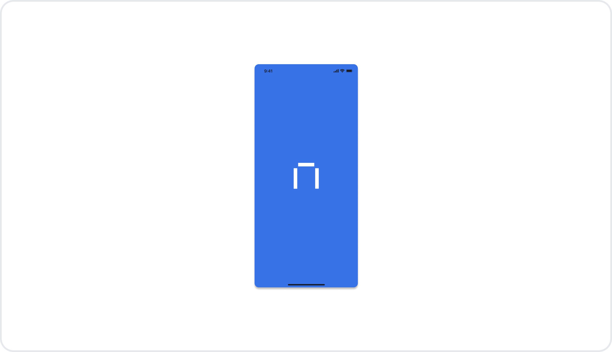

## Экран онбординга
Когда пользователь впервые заходит в приложение, он видит экран онбординга. Там его коротко знакомят с тем, как здесь всё устроено.
Экран онбординга, в свою очередь, содержит два информационных экрана: между ними можно перемещаться, пролистывая их вперёд или назад.
При последующих запусках приложения экран онбординга не показывается.

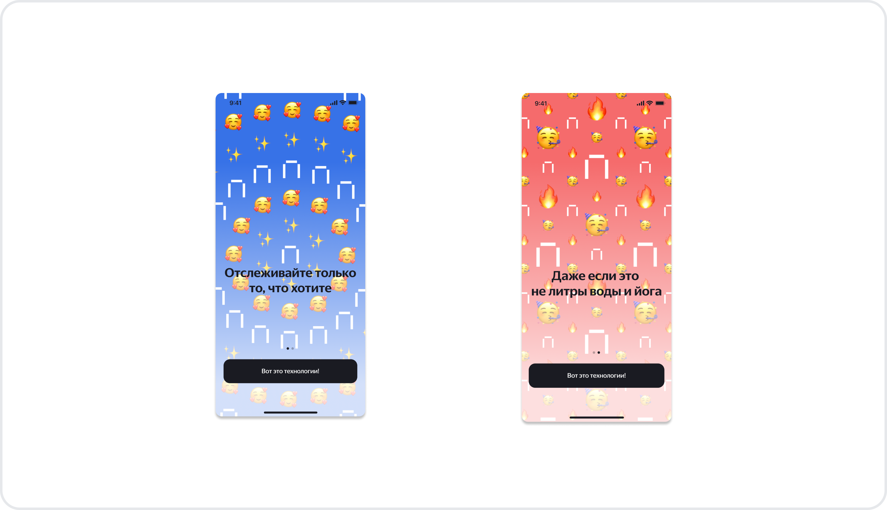 

## Главный экран. Трекер
После экрана онбординга (или сразу после загрузки приложения, если это не первый запуск) пользователь попадает на главный экран. Он содержит две вкладки: Трекеры и Статистика. Чтобы переключаться между ними, используют UITabBar.

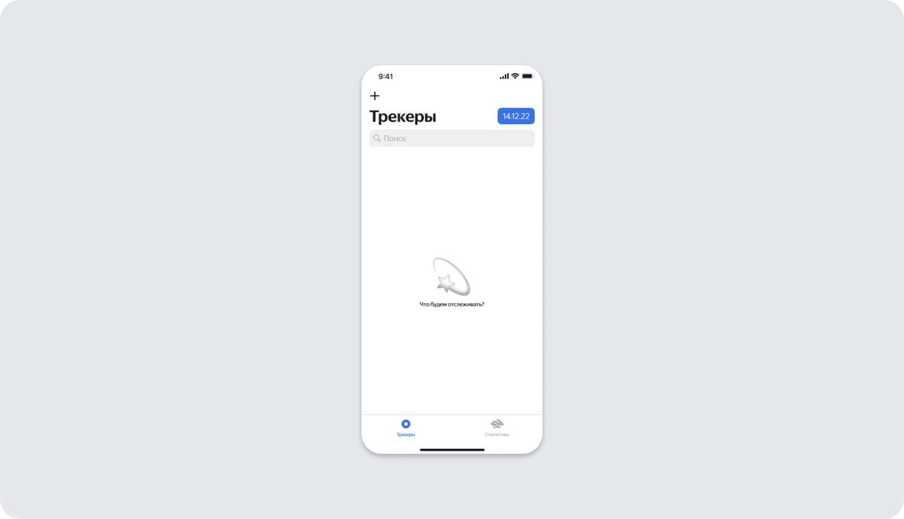

Вкладка Трекер содержит заголовок — кнопку +. С её помощью можно добавлять новые трекеры, строку их поиска и кнопку выбора даты. Также в заголовке есть список всех трекеров. В самом начале работы у пользователя их ещё нет, на этом месте мы показываем картинку заглушку.
После того как пользователь создаст свои трекеры, их список появится на соответствующей вкладке. Чтобы отображать этот список, мы используем элемент интерфейса — UICollectionView.

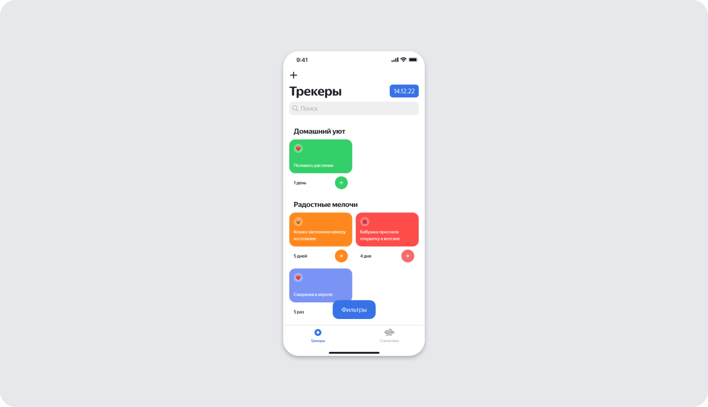

Пользователь может настраивать отображение трекеров в своём списке, выбирая даты и фильтры. Когда человек нажмёт на кнопку выбора даты, он увидит календарь; там же можно посмотреть список трекеров, привязанный к конкретной дате.

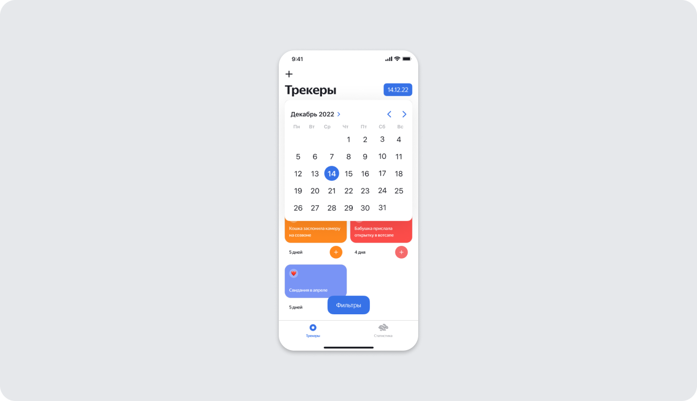

Нажав на кнопку Фильтры, пользователь увидит экран, который позволяет выбирать один из вариантов отображения трекеров.

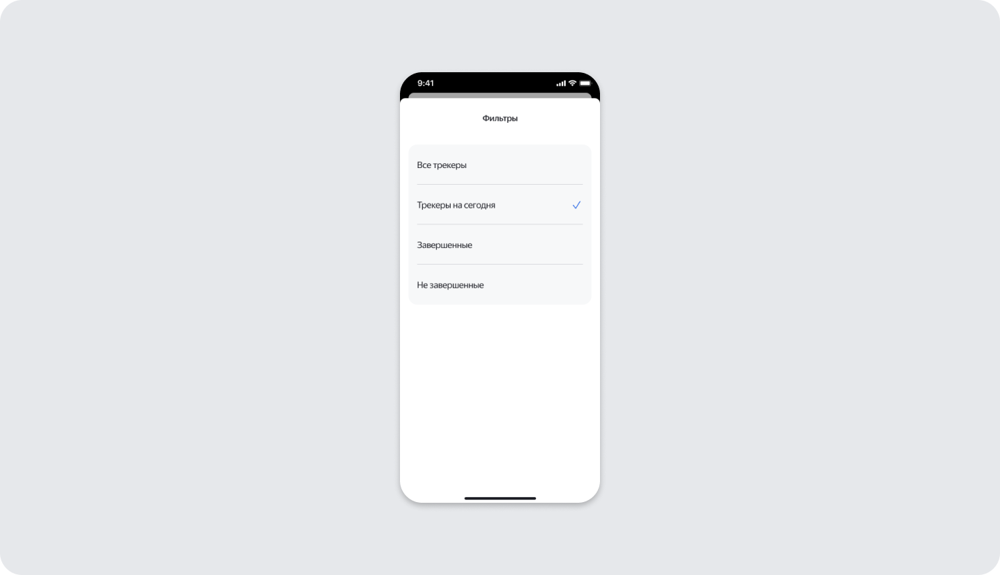

Пользователь может добавлять свои трекеры. Нажав на кнопку +, он увидит модальный экран, на котором можно выбрать тип нового трекера.

В приложении предусмотрены два типа трекеров: привычка и нерегулярное событие.

- Привычка – это регулярное событие, для которого можно задать дни повторения. При создании привычки пользователь выбирает название, категорию, дни недели, цвет и эмодзи трекера.
- Нерегулярное событие – это однократное действие, создаваемое на определённую дату. Оно может быть выполнено только один раз. При создании нерегулярного события доступны те же параметры, что и для привычки, за исключением дней повторения.

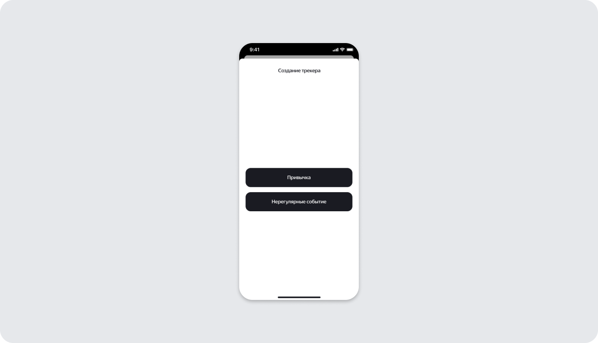

Если пользователь захочет создать «Нерегулярное событие», он увидит экран создания «Нерегулярного события». На этом экране нужно будет ввести название нового трекера, выбрать для него категорию, эмодзи и цвет. Внизу есть две кнопки: Создать и Отменить. Для списка эмодзи и цвета, используем UICollectionView.

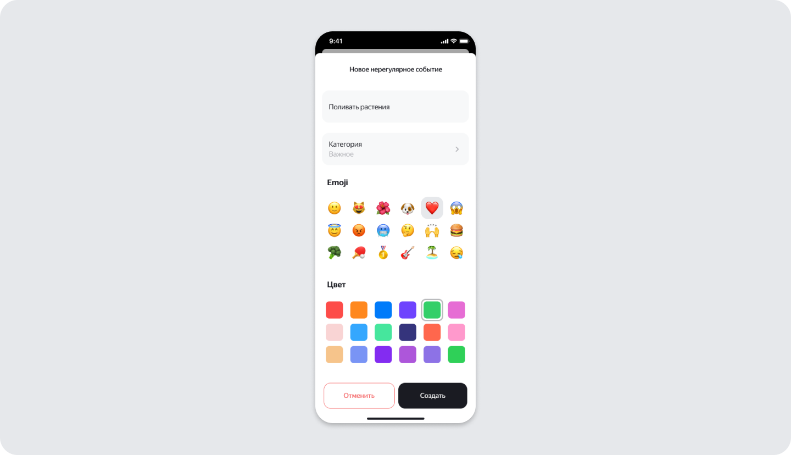

Если же пользователь захочет создать «Привычку», он увидит экран создания «Привычки». Этот экран содержит все те же элементы, что и экран создания «Нерегулярного события», но также даёт возможность выбирать расписание.

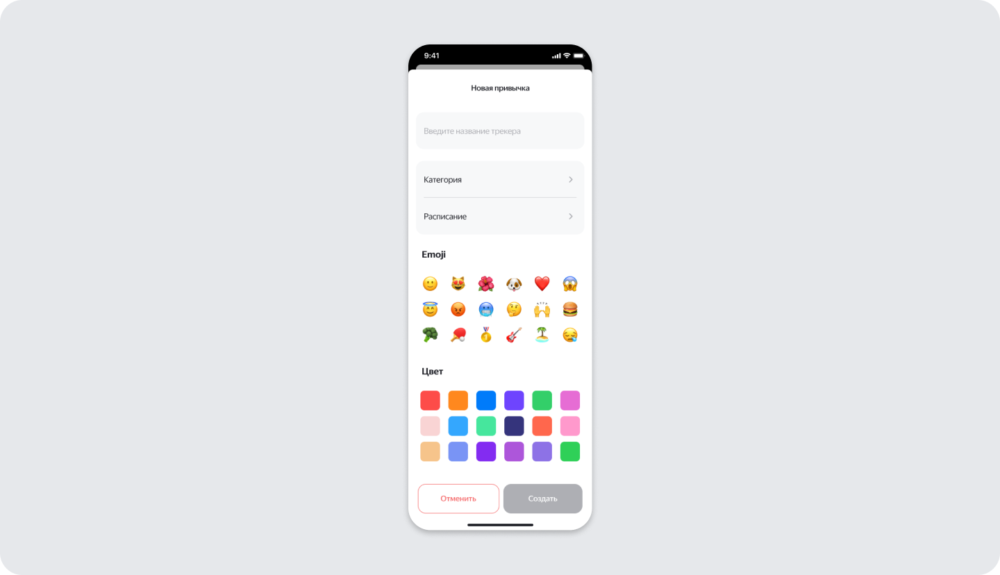

Расписание

Главный экран. Статистика
Если по параметру статистики пока недостаточно, отображается заглушка

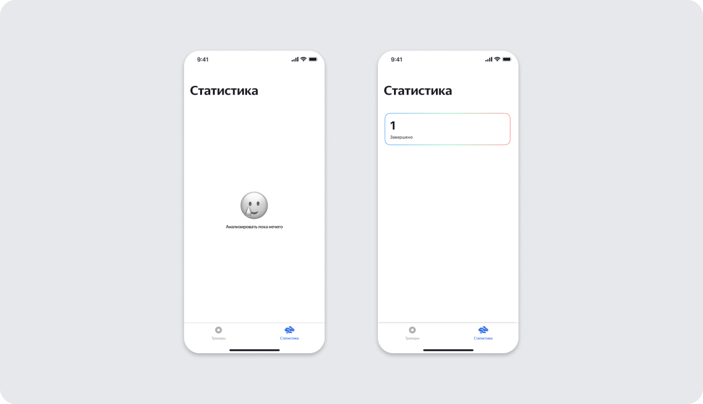

## Экран редактирования 
При долгом нажатии на ячейку отображается контекстное меню.
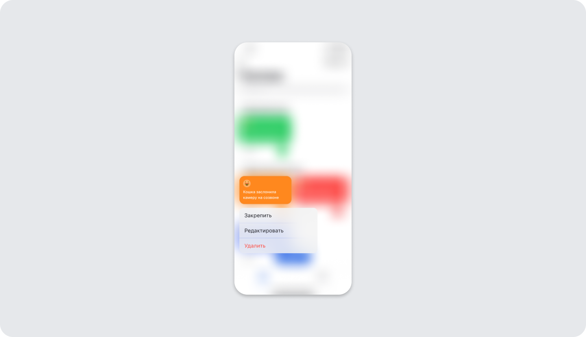

## Тёмная тема
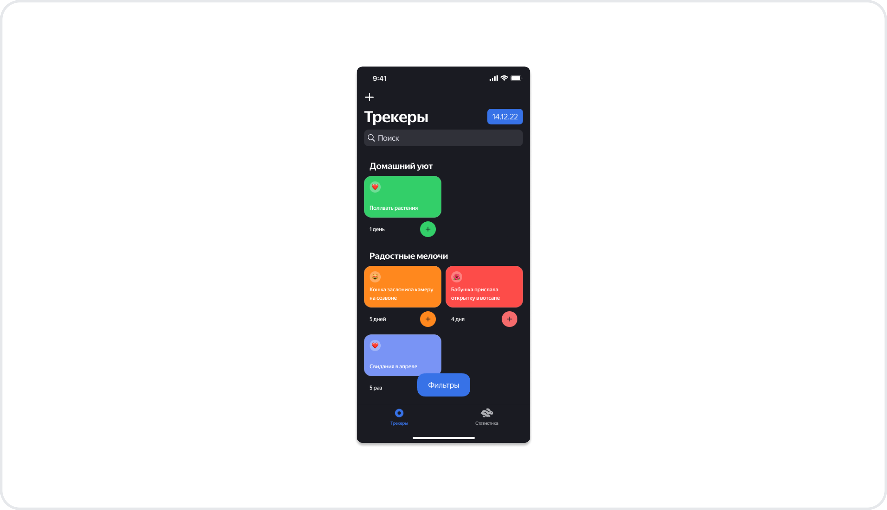

## Английская локализация:
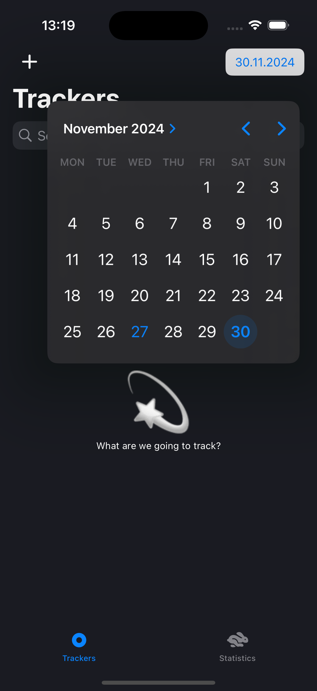
